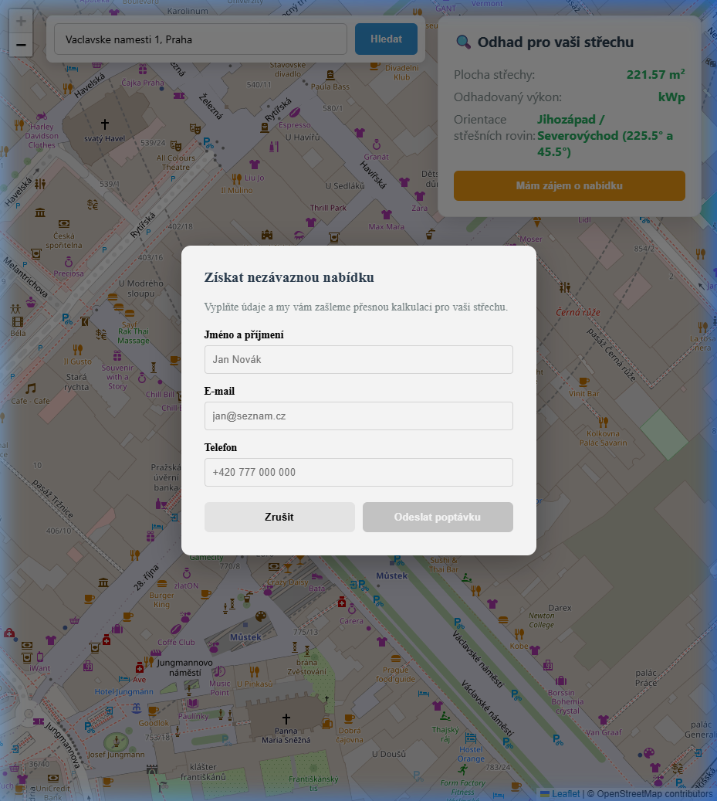

# GeoSolar

GeoSolar is a comprehensive B2B lead-generation tool designed specifically for companies that install solar panels. This project serves as a showcase of my web development capabilities and represents a ready-to-use solution for capturing highly qualified customer leads.

It provides an intuitive map interface for prospective customers to click on their building and instantly receive an estimation of its roof area, orientation, and potential solar power capacity (kWp). Customers can then submit their contact details along with the calculated roof data directly to the solar installation company.


<details>
<summary>Click to view Lead Form</summary>
<br>

</details>

## 🎯 Business Value
Sales representatives in the solar industry spend hours manually estimating roof areas on maps. This application automates the process. A customer can search an address anywhere in the world, and the service returns the real building footprint, actual square meter area (via Smart CRS Routing), primary roof orientation (Azimuth), and an estimated solar capacity (kWp).

## Features
- **Interactive Map:** Powered by Leaflet and OpenStreetMap.
- **Address Search:** Integrated Nominatim Geocoding API to quickly fly to any location.
- **Instant Solar Calculation:** Automatically calculates roof area, primary axis orientation, and estimates kWp yield based on building geometry.
- **Lead Generation:** Integrated form to collect user contact details alongside the calculated roof data.

## Architecture
The project is structured as a monorepo containing two main components:
- **`frontend/`**: An Angular 17+ single-page application (SPA).
- **`backend/`**: An ASP.NET Core 8 API providing geometric calculations and email services.

---

## 🚀 Getting Started

### 1. Backend Setup (ASP.NET Core)
1. Ensure you have the [.NET 10.0 SDK](https://dotnet.microsoft.com/download) installed.
2. Navigate to the backend directory:
   ```bash
   cd backend
   ```
3. Run the API:
   ```bash
   dotnet run
   ```
   *The API will start on `http://localhost:5093`.*

### 2. Frontend Setup (Angular)
1. Ensure you have [Node.js](https://nodejs.org/) (v18+) and npm installed.
2. Navigate to the frontend directory:
   ```bash
   cd frontend
   ```
3. Install dependencies:
   ```bash
   npm install
   ```
4. Start the development server:
   ```bash
   npm run start
   ```
   *The application will be available at `http://localhost:4200`.*

---

## Technical Stack
* **Frontend:** Angular 17, TypeScript, SCSS, Leaflet
* **Backend:** C# 12, ASP.NET Core 10 Minimal APIs, NetTopologySuite, ProjNet, Polly
* **Data Sources:** OpenStreetMap (Overpass API for building geometry, Nominatim for address search)

## 🏗️ Extensibility & Architecture
This project demonstrates the intersection of **GIS (Geographic Information Systems)** and solid **Software Engineering**:
- **Smart CRS Router (Global Scale):** Calculating accurate square meters from spherical GPS coordinates requires local planar projections. The backend implements a dynamic routing system (`ProjNET`) that automatically uses **S-JTSK (EPSG:5514)** for millimeter precision in CZ/SK, or calculates the correct **UTM Zone** for the rest of the world.
- **Dependency Injection & Swappable Sources:** Core spatial logic is decoupled from external APIs. Upgrading from the current free OpenStreetMap source to premium data (like the **Google Solar API** or **Local Cadastral Data**) requires zero changes to mathematical logic.
- **Fault Tolerance:** External HTTP calls are wrapped in `Polly` Wait-and-Retry policies to gracefully handle 504 Gateway Timeout or 502 Bad Gateway errors.

## License
This project is showcased as part of my professional portfolio. It is **not** licensed for open-source redistribution or commercial use without permission. If you are a solar installation company interested in using or customizing this tool for your business, please contact me!
